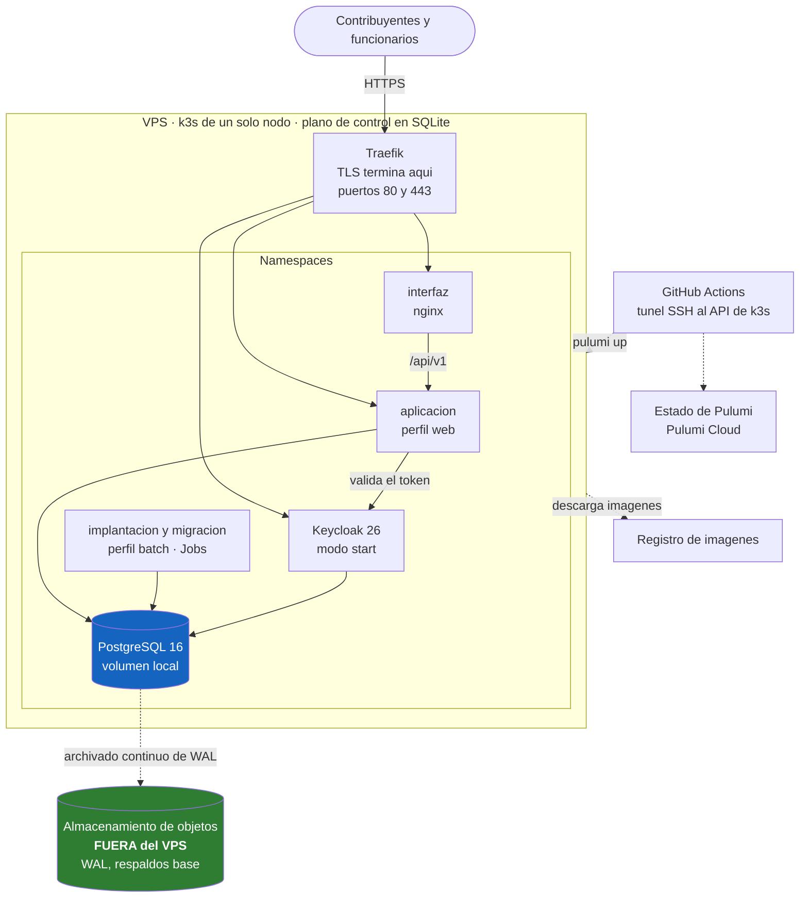

# INF-01 — Arquitectura de infraestructura

| Campo | Valor |
|---|---|
| Versión | 0.1 |
| Fecha | 2026-08-20 |
| Estado | Borrador |
| Decisión de origen | [`ADR-0011`](../30-arquitectura/adr/ADR-0011-infraestructura-como-codigo.md) |
| RNF | RNF-070 a RNF-079 |

## 1. La topología de producción

**Un VPS.** Todo lo que sigue es consecuencia de esa frase.

Lo que hay que leer del dibujo son las **líneas punteadas que salen del recuadro**: son las cuatro
cosas de las que depende volver a tener un sistema si el recuadro desaparece. Ninguna vive dentro.

### 1.1 Por qué un solo nodo, y qué cuesta

El [INF-01 del SRTM](https://github.com/hneyra/srtm/blob/main/docs/80-infraestructura/arquitectura-de-infraestructura.md)
diseña **tres nodos servidor** porque k3s con un solo servidor guarda su plano de control en SQLite
y un fallo de ese nodo deja el clúster sin plano de control. Tres es el mínimo para quórum de etcd.
Es correcto y aquí **no se copia**, porque aquí hay un VPS.

El apartamiento se escribe con su costo, y el costo es este:

| Lo que el SRTM obtiene con tres nodos | Lo que hay aquí |
|---|---|
| Pierde un nodo servidor y el clúster sigue con quórum de 2 de 3 | **Pierde el nodo y el servicio se cae** |
| El primario de PostgreSQL se pierde y se **promueve** una réplica | No hay réplica. Se **restaura** desde el archivado de WAL |
| Actualizar un nodo es drenarlo y reincorporarlo, sin caída | **Cualquier mantenimiento del VPS es una ventana de indisponibilidad anunciada** (RNF-078) |
| El RTO se mide en el tiempo de una promoción | El RTO se mide en el tiempo de una **restauración**, y crece con el padrón (RNF-077) |

Las cuatro filas son la misma frase dicha de cuatro maneras: **la recuperación aquí no es una
conmutación, es una reconstrucción.** Por eso el respaldo tiene que estar fuera (§1.3), por eso el
RTO se mide en horas (§5) y por eso el simulacro de restauración no es opcional (INF-03 §2).

Lo que **no** se hace es copiar la topología de tres nodos en el documento y seguir afirmando el
RTO que esa topología sostenía. Un objetivo de recuperación heredado de una arquitectura que no se
construyó es la forma más cómoda de no cumplirlo nunca.

### 1.2 Por qué el motor de datos está dentro del clúster

Un PostgreSQL gestionado del proveedor quitaría de encima el archivado de WAL, el PITR y las
actualizaciones menores, que es justo el trabajo más delicado de esta lista. Se descarta por dos
motivos, escritos en [`ADR-0011`](../30-arquitectura/adr/ADR-0011-infraestructura-como-codigo.md):

- **El aislamiento entre municipalidades se verifica contra la instancia real.** `verificarAislamiento`
  se conecta como `sgtm_app` —no como superusuario, porque un superusuario omite RLS incluso con
  `FORCE ROW LEVEL SECURITY`— y eso exige crear los cuatro roles con sus privilegios exactos en el
  motor que va a servir producción. Es el riesgo número uno del proyecto y no cambia porque la base
  esté en un pod.
- El costo mensual de un gestionado con PITR es comparable al del VPS entero.

**La contrapartida está anotada:** con la base dentro del nodo, el respaldo y su ensayo son
responsabilidad de este repositorio, no del proveedor. Si nadie los escribe, no existen.

**Ya están escritos** (issue #155): archivado continuo de WAL, respaldo base diario cifrado y un
simulacro de restauración que corre en cada PR. El cómo, y lo que de eso sigue sin verificarse
hasta que exista el VPS, está en [`INF-08`](respaldo-y-recuperacion.md).

### 1.3 Por qué los respaldos están fuera del VPS

**El camino de recuperación no puede depender de lo que se está recuperando.** Si el VPS se pierde
—o si simplemente se llena el disco, que es el escenario mucho más probable—, el archivado de WAL,
los respaldos base, el registro de imágenes y el estado de Pulumi tienen que seguir accesibles desde
otra máquina.

Es la pieza que hace posible el RPO de RNF-076 y el RTO de RNF-077. Un respaldo en el mismo disco
que la base no es un respaldo: es una copia del mismo punto único de falla.

### 1.4 El plano de control no se expone

El API de k3s (6443) **no responde desde internet**. CI llega a él abriendo un túnel SSH antes de
`pulumi up`, y el kubeconfig que Pulumi guarda como secreto apunta a `https://localhost:6443` por
esa razón. Es una cicatriz de `../iaac`, donde el kubeconfig con la IP del VPS hacía que el
proveedor de Kubernetes intentara salir por fuera del túnel y fallara sin decir por qué.

Desde fuera responden **80 y 443**, y nada más. Los puertos de PostgreSQL, Keycloak y la aplicación
no se publican: es lo que retira la última parte de la frase del README del compose.

## 2. Dimensionamiento inicial

⚠ **Estimaciones, no mediciones.** Se recalibran con la volumetría real de la municipalidad piloto,
que hoy no existe porque D-01 está abierta.

| Componente | Réplicas | CPU | Memoria | Almacenamiento |
|---|---|---|---|---|
| Nodo (el VPS entero) | 1 | 8 | 16 GB | 200 GB SSD |
| Reservado para kubelet, containerd y sistema | — | ~1 | ~1 GB | — |
| PostgreSQL 16 | 1 | 2–4 | 4–8 GB | Volumen local; el resto del disco |
| Aplicación, perfil `web` | 2 | 0,5–1 | 1–2 GB | — |
| Aplicación, perfil `batch` (Jobs) | 0–1 | 1–2 | 2 GB | — |
| Keycloak 26 | 1 | 0,5 | 1 GB | — |
| Interfaz (nginx) | 2 | 0,1 | 128 MB | — |
| Traefik | 1 | 0,2 | 256 MB | 128 Mi para `acme.json` |

**La reserva del sistema no es un adorno.** En `../iaac`, sobre un nodo sin `kube-reserved` ni
`system-reserved`, una ráfaga de una aplicación dejó sin CPU al kubelet, las sondas de todo el nodo
empezaron a agotar su tiempo y varios contenedores sanos murieron por fallo de sonda de vida. Un
solo nodo no tiene a dónde mover la carga: lo único que impide que una carga se lleve por delante
al plano de control es reservarle su parte.

**La ventana del perfil `batch` es 02:00, hora de Perú.** Con un solo nodo, la emisión masiva y la
ventanilla comparten CPU: no hay nodo dedicado como en el SRTM, y lo que hay son límites de
recursos, una clase de prioridad por debajo de todo lo demás y esa ventana. La consecuencia —una
emisión grande degrada la atención— queda escrita aquí, y no se descubre el día de la emisión. El
`CronJob` existe ya, **suspendido**: mientras D-02a siga abierta no hay regla de cálculo, y por
tanto no hay emisión masiva que correr; lo que declara hoy es la ventana y los límites con que
correrá cuando la haya.

**El dato que orienta el dimensionamiento de la base:** el particionado por ejercicio
([`ADR-0004`](../30-arquitectura/adr/ADR-0004-almacenamiento-de-datos.md)) mantiene acotado lo que
se consulta en caliente, pero el volumen total crece sin límite superior. La memoria de PostgreSQL
es el recurso crítico, no la CPU.

## 3. Red

| Elemento | Decisión |
|---|---|
| Ingreso | Traefik, el que k3s trae de fábrica |
| TLS | Certificado de Let's Encrypt por desafío HTTP-01, renovación automática. **TLS 1.3 como mínimo** — ver la nota de abajo |
| Puertos publicados | **80 y 443, y nada más.** 80 solo redirige a 443 |
| API de k3s | 6443 cerrado desde internet; se llega por túnel SSH (§1.4) |
| Políticas de red | Denegación por omisión entre namespaces; se abre solo lo necesario (issue #157) |
| Salida a internet | La aplicación no necesita ninguna hoy. Cuando aparezca la primera integración, va con lista de destinos permitidos |

**La salida restringida importa antes de que haya integraciones:** un compromiso de la aplicación
con salida libre permite exfiltrar el padrón completo de todas las municipalidades. Con lista de
destinos permitidos, no.

> **La versión mínima de TLS quedó en 1.3, y no en el «1.2 como mínimo» que decía esta tabla.**
> Lo fija el `TLSOption` de `infra/componentes/Ingreso.ts`, y viene de lo que el issue #153 no
> negocia. La consecuencia hay que saberla: **un navegador anterior a 2018 no entra**, y en una
> ventanilla municipal eso puede ser una máquina real. Si aparece, la decisión se revisa por
> escrito —aquí— y no aflojando esa línea en un despliegue de urgencia.

> **El cortafuegos del nodo no es un objeto de Kubernetes.** Pulumi habla con el API de k3s, no
> con el sistema operativo: que desde internet solo respondan 80 y 443 lo decide
> [`infra/vps/cortafuegos.sh`](../../infra/vps/cortafuegos.sh), que se ejecuta al aprovisionar el
> nodo. Y comprobarlo es una afirmación sobre lo que ve internet, así que **se comprueba desde
> fuera**, nunca desde el propio VPS.

## 4. Convenciones que ya costaron un incidente

No son buenas prácticas genéricas: son las cuatro cosas que `../iaac` aprendió operando esta misma
combinación —k3s, un VPS, PostgreSQL en un volumen `ReadWriteOnce`— y que aquí se aplican desde el
primer manifiesto en vez de después del primer susto.

| Convención | Qué pasa si falta |
|---|---|
| **Toda sonda declara `timeoutSeconds` explícito (3–5 s)** | El valor por omisión del kubelet es **1 s**. En un nodo ocupado, un pod sano pero atareado no contesta en 1 s, tres fallos seguidos de la sonda de vida matan el contenedor, y el código de salida es 143 —no OOM—, así que la investigación empieza en el sitio equivocado |
| **Los despliegues con estado y una sola réplica usan `strategy: Recreate`** | El `RollingUpdate` por omisión levanta un segundo pod que monta el mismo volumen `ReadWriteOnce` en el mismo nodo, no consigue el bloqueo del directorio de datos y el despliegue se queda colgado con la base parada |
| **Toda carga declara `requests` y `limits`, y las bases llevan `PriorityClass` propia** | Bajo presión de memoria el kubelet desaloja por orden de prioridad. Sin prioridades declaradas, puede desalojar PostgreSQL para dejar sitio a la interfaz |
| **El nodo reserva CPU y memoria para el sistema** (§2) | Una ráfaga de la aplicación deja sin CPU al kubelet y las sondas fallan **en todo el nodo a la vez** |

⚠ Aplicar la reserva del nodo **reinicia k3s**, es decir, corta el API server unos segundos. Va en su
propia ventana de mantenimiento, no en un `pulumi up` que además cambia otras cosas.

### 4.1 `verificarAislamiento` no se ejecuta contra un motor en servicio

Se descubrió leyendo lo que la prueba hace antes de verificar nada: **provisiona**. Crea una base
para la corrida y les asigna a los cuatro roles claves efímeras con `ALTER ROLE`
(`BaseDeDatosDePrueba.crearRoles`). Los roles son objetos **del clúster de PostgreSQL**, no de una
base: esas claves nuevas valen para todas sus bases a la vez.

Apuntarla al motor de una municipalidad en marcha, por tanto, **deja fuera a la aplicación** hasta
que alguien vuelva a aplicar el `Secret` — y el síntoma es un `28P01` en cada petición, que no se
parece en nada a «alguien corrió una prueba».

Y hay una segunda consecuencia de la misma frase —los roles son del clúster, no de la base—:
**contra un motor externo, las dos tareas de `verificarAislamiento` no se pueden ejecutar en
paralelo.** `org.gradle.parallel=true` las lanza a la vez, las dos hacen `ALTER ROLE` sobre los
mismos cuatro roles, y salen un `tuple concurrently updated` y un `password authentication failed`
que no se parecen en nada a su causa. Con Testcontainers no ocurre, porque cada tarea levanta su
propio contenedor. Por eso la invocación lleva `--no-parallel --max-workers=1`, y se descubrió
ejecutándola.

Dónde se ejecuta entonces, que es donde el criterio de #149 se cumple igual:

| Sitio | Cómo |
|---|---|
| CI, en cada PR que toca la infraestructura | `infra/verificaciones/motor/verificar-el-motor.sh --con-aislamiento` levanta un motor **con los guiones del manifiesto** y la ejecuta contra él |
| `stg`, en una ventana anunciada | Contra su motor, sabiendo que hay que reponer las claves después |
| `prod` | **Nunca** |

## 5. Escenarios de falla

| Falla | Qué pasa | Recuperación | ¿Runbook? |
|---|---|---|---|
| Un pod muere (aplicación, interfaz, Keycloak) | k3s lo reprograma en el mismo nodo | Automática, segundos | No hace falta |
| El pod de PostgreSQL muere | La aplicación devuelve error mientras tanto | Automática con `Recreate`; el volumen sigue ahí | No hace falta |
| **El nodo se cae o se reinicia** | **Caída completa del servicio.** No hay quórum que sobreviva ni réplica que promover | Vuelve solo al arrancar el VPS: k3s reinicia y los pods se reprograman. Si el disco está sano, minutos | [Reconstruir el VPS desde cero](../B0-operacion/runbooks/reconstruir-el-vps-desde-cero.md) |
| **El disco se llena** | PostgreSQL deja de aceptar escrituras; los pods nuevos no arrancan; el nodo puede pasar a `DiskPressure` y desalojar. **Es el escenario más probable de los tres**, y el que más se parece a una caída sin serlo | Liberar espacio: el WAL retenido cuando el almacenamiento de objetos no está accesible, los registros de contenedor y las imágenes viejas. La alerta de espacio libre tiene que llegar antes (issue #156) | [El disco del nodo se llenó](../B0-operacion/runbooks/el-disco-del-nodo-se-lleno.md) |
| **Se pierde el VPS entero** | Todo lo de dentro deja de existir | VPS nuevo → k3s → `pulumi up` del stack → restauración PITR desde el almacenamiento de objetos → verificar → apuntar el DNS. **RTO objetivo: 4 h (RNF-077)** | [Reconstruir el VPS desde cero](../B0-operacion/runbooks/reconstruir-el-vps-desde-cero.md), y el simulacro en INF-03 §2 |
| El almacenamiento de objetos no está accesible | La operación **sigue**. El WAL se acumula en el disco local, y de ahí a la fila anterior | Restablecer el destino; el WAL acumulado se drena solo. Alerta inmediata: es el aviso de que el RPO ya no se cumple | [El disco del nodo se llenó](../B0-operacion/runbooks/el-disco-del-nodo-se-lleno.md) §1 |
| Keycloak no está disponible | Quien ya entró sigue hasta que expire su token; **nadie nuevo entra**. La aplicación **no** se cae: con `jwk-set-uri` configurado el validador no necesita descubrimiento | Reprogramación del pod | [Keycloak no responde](../B0-operacion/runbooks/keycloak-no-responde.md) — solo si el pod no vuelve solo |
| El certificado no renueva | El navegador rechaza la conexión. El desafío HTTP-01 necesita el puerto 80 abierto | Alerta a 21 días del vencimiento, no el día del vencimiento | [Mantenimiento del VPS](../B0-operacion/runbooks/mantenimiento-del-vps.md) §5 |
| Pulumi Cloud no está disponible | **No se puede modificar la infraestructura.** Lo que corre sigue corriendo | Esperar, o tomar la salida de `ADR-0011` §3 | No hace falta |

**Los ocho runbooks de issue #158 están escritos**, en
[`docs/B0-operacion/runbooks/`](../B0-operacion/runbooks/). Lo que ninguno tiene todavía
es el ensayo completo contra un VPS real —el propio índice de runbooks lo dice sin
adornarlo—, porque ese VPS no existe mientras D-01 siga abierta. Escribir el
procedimiento es necesario y no es lo mismo que haberlo corrido: es la distinción que
cada runbook marca en su propia sección «Estado del ensayo».

La fila del RTO de 4 h es la que hay que probar y la que se posterga con más facilidad. **Un RTO que
nunca se ensayó es una aspiración, no un requisito**, y el sitio donde se ensaya está en INF-03 §2.

## 6. Ambientes

Detalle en [`ambientes.md`](ambientes.md) (INF-03). Resumen de topología:

| Ambiente | Topología | Notas |
|---|---|---|
| local | `docker compose` en la máquina del desarrollador | No es un stack de Pulumi. No se retira |
| `stg` | Un VPS más pequeño, mismo `index.ts` | **Donde se ensaya la restauración** |
| `prod` | El VPS | |

## 7. Pendientes

- [ ] Confirmar el proveedor del VPS y el dimensionamiento de §2 con volumetría real (bloqueado por D-01).
- [x] Definir el proveedor del almacenamiento de objetos externo, que es donde vive el RPO (§1.3). AWS S3, 2026-08-24 — buckets `sgtm-stg-respaldos`/`sgtm-prod-respaldos`, `us-east-1`, confirmado contra un respaldo real (issue #158).
- [ ] Ensayar [reconstruir el VPS desde cero](../B0-operacion/runbooks/reconstruir-el-vps-desde-cero.md) contra un VPS real y anotar el tiempo (issue #158; los ocho runbooks ya están escritos, y su clúster **y su restauración PITR** —no el VPS mismo— ya se reconstruyeron una vez, 2026-08-24, 359s medidos).
- [ ] Definir la ventana de mantenimiento y cómo se anuncia (RNF-078).
- [ ] Definir la lista de destinos de salida permitidos cuando aparezca la primera integración (§3).
- [ ] Medir cuánto tarda de verdad la restauración con el padrón del piloto, y corregir RNF-077 si
      el número no se sostiene. El procedimiento ya se cronometró (359s, issue #158) pero con unas
      pocas filas de ensayo, no con volumetría real — ese número sigue pendiente.

## 8. Documentos relacionados

[`ambientes.md`](ambientes.md) (INF-03) ·
[`ADR-0011`](../30-arquitectura/adr/ADR-0011-infraestructura-como-codigo.md) ·
[`REQ-02 §Operación`](../20-requisitos/requisitos-no-funcionales.md) ·
[`ARQ-03 — Estrategia multi-tenant`](../30-arquitectura/estrategia-multitenant.md) ·
[`entorno-local-de-desarrollo.md`](entorno-local-de-desarrollo.md) (INF-11) ·
[Runbooks de operación](../B0-operacion/runbooks/) (§5 de este documento) ·
[`despliegue/README.md`](../../despliegue/README.md) — el compose, que sigue siendo el entorno local
